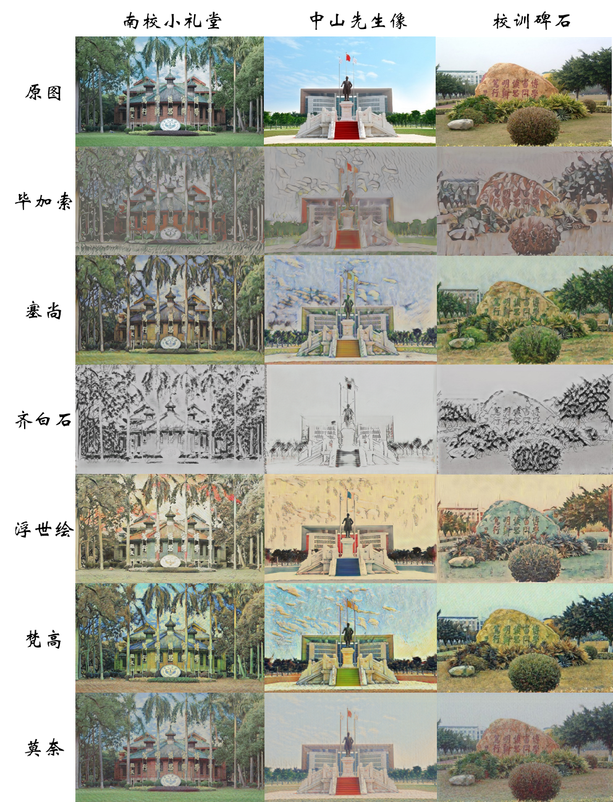
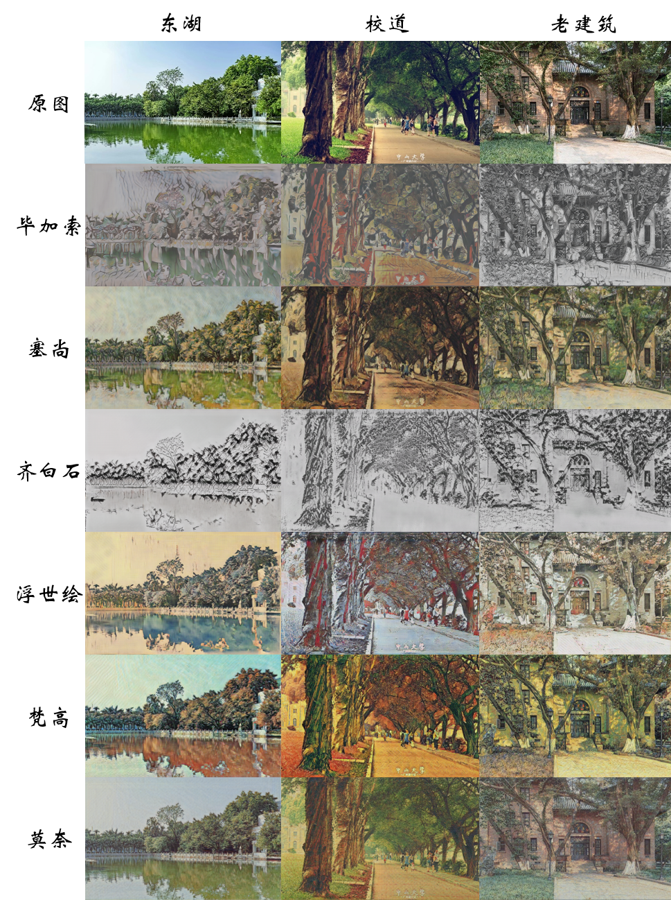

CycleGAN Style Transfer
====
Style transfer using CycleGAN, and some adaptations

### CycleGAN

[CycleGAN](https://github.com/junyanz/CycleGAN "Code")  

### Color Histogram Matching
#### 1.Global color histogram matching
#### 2.Local color histogram matching

### Mask Style Transfer
