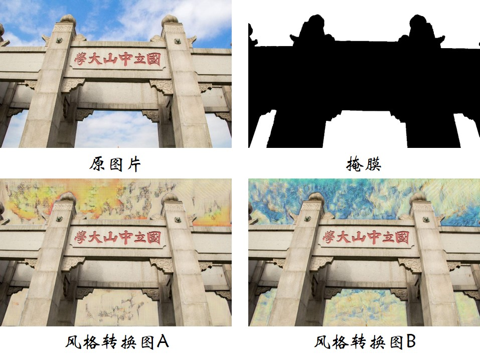

CycleGAN Style Transfer
====
Style transfer using CycleGAN, and some adaptations

CycleGAN [[Source Code]](https://github.com/junyanz/CycleGAN "Code")  

### SYSU collection

### Picasso's portrait style

  
  
  
  
  
  

### Color Histogram Matching

Original Photo

 

Style Transferred Image

#### 1.Global color histogram matching

#### 2.Local color histogram matching

#### 3.Linear color matching

#### 4.Comparison

### Mask Style Transfer

#### 1.Local style transfer

#### 2.Mixture style transfer

